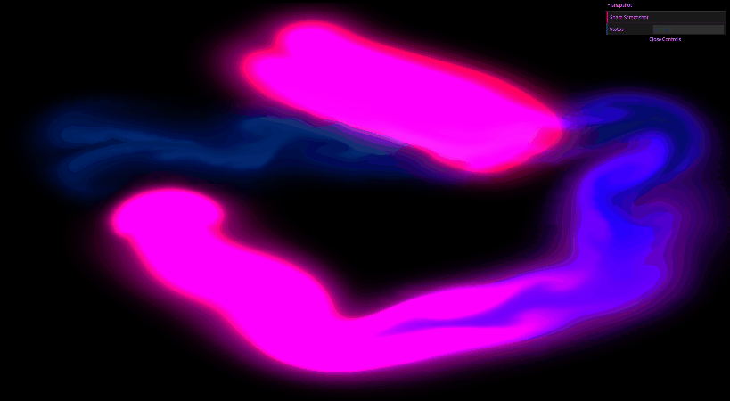
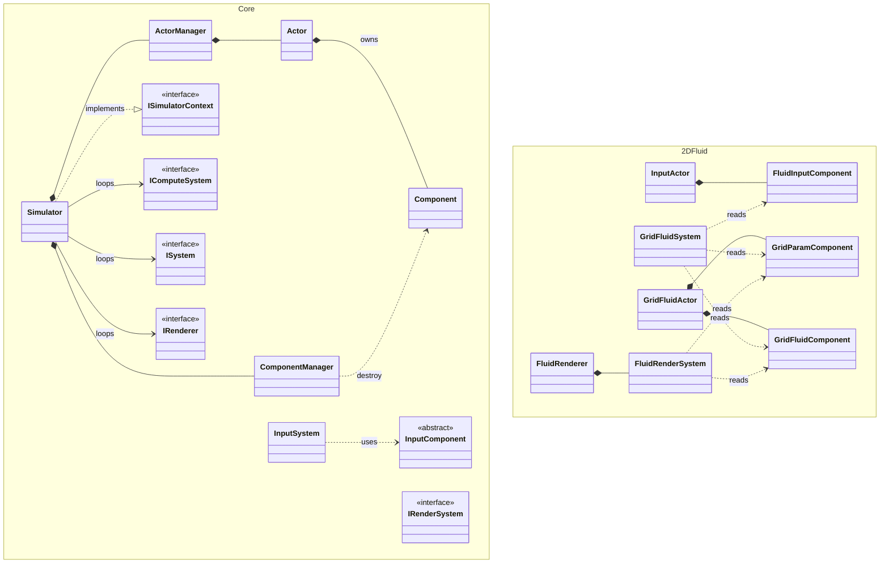

# WebGPU Simulation

WebGPUを利用したリアルタイム2D Fluid Simulation プロジェクトです。  
GPU Compute Pipelineを利用し、ブラウザ上で流体シミュレーションをリアルタイムに実行します。
---

# Demo

[Live Demo](https://shouk12345.github.io/WebGPU-Simulation/)

## Simulation

## Screenshot Sharing

---

# Features

- WebGPU Compute Shaderを用いたGPUベースの流体シミュレーション
- Advection、Curl、Vorticity、Pressure solve、Gradient演算によるMulti-pass Compute Pipeline
- Ping-Pong bufferを利用したGPUリソース管理
- SimulatorをメインとしたActor/ComponentベースのCore Architecture
- core/demo分離及びinterfaceを利用したfacade patternのArchitecture
- AWS + S3 + AWS Lambdaを利用したスクリーンショットシェア機能
- Github ActionsによるGithub Pages自動デプロイ

---

# Architecture Overview

*継承関係  
Actors: InputActor, GridFluidActor  
Components: InputComponent, GridParamComponent, GridFluidCompnent  
InputComponent: FluidInputComponent  

*実装関係  
ISystem: InputSystem  
IComputeSystem: GridFluidSystem  
IRenderSystem: FluidRenderSystem  
IRenderer: FluidRenderer  

*設計上の補足  
demo内すべてのSystem、Renderer、ActorはISimulatorContextを経由しSimulatorのActorManager、ComponentManagerにアクセス  
FluidInputComponentはISimulatorContextを経由しemit際にGridParamComponentのパラメータ値を参照  
IRenderSystemはIRendererからループされる設計だが、interfaceレベルでの強制なし  
demoではFluidRendererがFluidRenderSystemを所有し、Render()を直接呼び出す構造で実現  
2DFluidDemo.tsはクラスではなくエントリーポイントとして使用

---

# Core

Simulatorはメインループシステムとして、  
生成、更新、削除のライフサイクル管理を担当します。   

Simulatorのinit()では、ActorManager、ComponentManager、各System、Rendererが初期化されます。    
SimulatorのUpdate()では、ActorManager、ComponentManager、各System、Rendererが更新されます。 　

ActorManager、ComponentManagerは、  
ActorとComponentのライフサイクル管理を担当しており、値更新は各システムで用途に合わせて行います。  

Actorはエンティティとして複数のComponentを所有し、Actor削除時にActorが所有してるComponentも削除されます。  
ISimulatorContextを用いてデモプログラム側へActor、Componentへアクセスするインタフェースを提供しています。  

# Compute Pipeline

Fluid Simulationは複数のCompute passに分割して実装しました。  

各PassはGPU Compute Pipelineとして独立して構成されており、  
Read/Writeの整合性を維持するため、Ping-Pongパターンを利用しています。  

---

# Screenshot Sharing

Fluid Simulationではスクリーンショットシェア機能を提供しています。

canvasの描画データをPNG形式のBlobとして取得し、AWS S3へアップロードしました。  
アップロード後AWS Lambda関数を用いてスクリーンショット共有用URLを生成し、  
シミュレーションスクリーンショットを外部から参照できる構成としています。

---

# Tech Stack

## Simulation

- WebGPU
- WGSL
- TypeScript

## Cloud

- AWS S3
- AWS Lambda

## Deployment

- GitHub Actions
- GitHub Pages

---

# Challenge

## CoreとDemoの分離及び階層間の依存性調整

Fluid SimulationはCore層を基盤Layerとして利用して、  
DemoではCoreの設計構造を活用して実装するように設計しました。  

Demo側はCoreのMain Loopや内部構造に直接依存しない構成を目指しています。  
Actor、Component、System、Rendererなどを継承/実装することで利用できるように設計しています。  

また、Simulatorはグローバルに参照されるSingleton構成である必要がなかったため、  
ISimulatorContextを利用してFacade Patternを採用しました。  

これにより、Actor/Componentへのアクセス権のみをDemo側へ伝達し、  
CoreとDemo間の依存関係を最小化しました。  

さらに、各レイヤ及びモジュールの責務を分離することで、  
シミュレーションロジックと実行環境を独立して拡張しやすい構造を目指しました。

---

## DemoでのComponent扱い規則

TypescriptではオブジェクトのDelete処理をGarbage collectorで行います。  
そのため、ActorやComponentのライフサイクル管理の重要度はより増します。  

Demo層ではComponentやActorの更新や参照を行う際にDangling Referenceを起こさないために、  
使用する度にISimulatorContextを経由してComponent/Actorを取得するよう設計しました。

---

## Compute Pipeline の整合性管理

Fluid Simulationでは、AdvectionやPressure Solveなど
周囲セルの値を参照するCompute Passを利用しているため、
GPU並列実行時のRead/Write整合性管理が必要でした。

そのため、Ping-Pong パターンを利用して  
各Passの入力Bufferと出力Bufferを分離し、
状態遷移を管理しています。

また、Splatのような周囲セルを参照しない局所的な変更処理については、
状態遷移ではなく現在状態への加算処理として扱いました。  

一方で、CurlやVorticityのように周囲セルを参照する必要があるPassについては、  
Velocity Buffer→単一Buffer(CurlBufferなど)→Velocity Bufferに更新する構成としています。  

これにより、Compute Passごとの責任を分離するように意識しました。

---

# Goals

- WEBGPUを用いたGPU並列処理の理解
- Compute Shaderによるシミュレーションパイプライン設計
- GPUリソース整合性管理の理解及び大規模シミュレーションにおけるPass分散
- Actor/ComponentベースのArchitecture
- Facade Patternを利用してCoreとDemoの分離、これによるDemo間の分離設計
- GPUシミュレーションとクラウド機能を統合したシステム開発
- 将来的な3D Simulation/分散処理への拡張を見据えた設計

---

# Future Work

- 流体の減衰度による速度影響実装
- サーバーサイドにも対応できるアーキテクチャへ拡張
- SPH法による3D流体シミュレーションDemo実装

# Reference
- GPU Gems - Fast Fluid Dynamics Simulation on the GPU  
  (https://developer.nvidia.com/gpugems/gpugems/part-vi-beyond-triangles/chapter-38-fast-fluid-dynamics-simulation-gpu)

- Stable Fluids - Jos Stam  
  (https://pages.cs.wisc.edu/~chaol/data/cs777/stam-stable_fluids.pdf)